# Contributing to DevOps Terraform Modules

## Introduction
Welcome to DevOps Terraform Modules! This document outlines guidelines for contributing to this repository. Following these guidelines helps to keep our repo well maintained and standardized.

## Getting Started
Before you begin:
- Familiarize yourself with Terraform Modules directory and the specific modules in this repository.
- Read through the documentation, including `README.md` files in various directories.
- Workflow for contributing is `feature/*` -> `main`

## Reporting Issues
If you encounter bugs, please create an issue on GitHub using the repo's issue template

## Making Contributions
To contribute, follow these steps:
1. **Feature Branch:** Create a feature branch in called `feature/<your_feature_name_here>`
2. **CI/CD:** A feature branch pipeline will run to test your changes - **ONLY MERGE YOUR FEATURE BRANCH IF THE CI PIPELINE IS PASSING**
3. **CHANGELOG:** You must follow the format of the changelog and update it with a description of your feature before merging to `main`

## Check for Existing Modules

**Before Creating a New Module:**
   - Search the AVM/AWS repository on the HashiCorp Terraform Registry to check if the desired resource or pattern module already exists.
   - If an appropriate module exists, use it directly or consider contributing to it for any necessary enhancements.

## Creating a New Module

**If the Module Does Not Exist:**
   - Follow the guidelines below to create a new module, adhering to our organisation's adaptation of the AVM standards.

## Mandatory Standards

Each new module must comply with the following mandatory standards:

- **Composition:**
  - Ensure the module is aligned to the Well Architected Framework ([SFR2](https://learn.microsoft.com/en-gb/azure/well-architected/service-guides/?product=popular))
  - Availability Zones ([SFR5](https://azure.github.io/Azure-Verified-Modules/specs/shared/#id-sfr5---category-composition---availability-zones))
  - Data Redundancy ([SFR6](https://azure.github.io/Azure-Verified-Modules/specs/shared/#id-sfr6---category-composition---data-redundancy))
  - Resource Naming ([SNFR25](https://azure.github.io/Azure-Verified-Modules/specs/shared/#id-snfr25---category-composition---resource-naming))
  - Single Resource Only ([RMFR1](https://azure.github.io/Azure-Verified-Modules/specs/shared/#id-rmfr1---category-composition---single-resource-only))
  - Resource Groups ([RMFR3](https://azure.github.io/Azure-Verified-Modules/specs/shared/#id-rmfr3---category-composition---resource-groups))
  - Dependency Management ([RMFR8](https://azure.github.io/Azure-Verified-Modules/specs/shared/#id-rmfr8---category-composition---dependency-on-child-and-other-resources)). Extends to UKHSA developed modules.
  - \* _Consistent Feature & Extension Resources Value Add_ ([RMFR4](https://azure.github.io/Azure-Verified-Modules/specs/shared/#id-rmfr4---category-composition---avm-consistent-feature--extension-resources-value-add))
  - \* _Consistent Feature & Extension Resources Value Add Interfaces/Schemas_ ([RMFR5](https://azure.github.io/Azure-Verified-Modules/specs/shared/#id-rmfr5---category-composition---avm-consistent-feature--extension-resources-value-add-interfacesschemas))

- **Testing:**
  - Test Tooling ([TFNFR5](https://azure.github.io/Azure-Verified-Modules/specs/terraform/#id-tfnfr5---category-testing---test-tooling)) using Checkov and [tflint](https://github.com/terraform-linters/tflint-ruleset-azurerm).
  - \* _E2E Testing_ ([SNFR2](https://azure.github.io/Azure-Verified-Modules/specs/shared/#id-snfr2---category-testing---e2e-testing))
  - \* _Unit Tests_ ([SNFR4](https://azure.github.io/Azure-Verified-Modules/specs/shared/#id-snfr4---category-testing---unit-tests))
  - \* _Upgrade Tests_ ([SNFR5](https://azure.github.io/Azure-Verified-Modules/specs/shared/#id-snfr5---category-testing---upgrade-tests))
  - \* _Idempotency Tests_ ([SNFR7](https://azure.github.io/Azure-Verified-Modules/specs/shared/#id-snfr7---category-testing---idempotency-tests))

- **Inputs and Outputs:**
  - Parameters/Variables for Resource IDs ([SNFR22](https://azure.github.io/Azure-Verified-Modules/specs/shared/#id-snfr22---category-inputs---parametersvariables-for-resource-ids))
  - Parameter/Variable naming ([RMFR6](https://azure.github.io/Azure-Verified-Modules/specs/shared/#id-rmfr6---category-inputs---parametervariable-naming))
  - Minimum Required Outputs ([RMFR7](https://azure.github.io/Azure-Verified-Modules/specs/shared/#id-rmfr7---category-outputs---minimum-required-outputs))

- **Code Styling:**
  - Use lower_snake_casing for configuration block names ([TFNFR4](https://azure.github.io/Azure-Verified-Modules/specs/terraform/#id-tfnfr4---category-composition---code-styling---lower-snake_casing))
  - Orders Within resource and data Blocks ([TFNFR8](https://azure.github.io/Azure-Verified-Modules/specs/terraform/#id-tfnfr8---category-code-style---orders-within-resource-and-data-blocks)). [AVM Fix](https://github.com/lonegunmanb/avmfix) can be used for this.
  - Use coalesce or try when setting default values for nullable expressions ([TFNFR13](https://azure.github.io/Azure-Verified-Modules/specs/terraform/#id-tfnfr13---category-code-style---use-coalesce-or-try-when-setting-default-values-for-nullable-expressions))
  - All verified modules MUST have terraform.tf file and required_version MUST be set ([TFNFR25](https://azure.github.io/Azure-Verified-Modules/specs/terraform/#id-tfnfr25---category-code-style---all-verified-modules-must-have-terraformtf-file-and-required_version-must-be-set))
  - Providers MUST be declared in the required_providers block in terraform.tf and MUST have a constraint on minimum and maximum major version ([TFNFR26](https://azure.github.io/Azure-Verified-Modules/specs/terraform/#id-tfnfr26---category-code-style---providers-must-be-declared-in-the-required_providers-block-in-terraformtf-and-must-have-a-constraint-on-minimum-and-maximum-major-version))
  - \* _Order within a module block_ ([TFNFR9](https://azure.github.io/Azure-Verified-Modules/specs/terraform/#id-tfnfr9---category-code-style---order-within-a-module-block))
  - \* _Null comparison as creation toggle_ ([TFNFR11](https://azure.github.io/Azure-Verified-Modules/specs/terraform/#id-tfnfr11---category-code-style---null-comparison-as-creation-toogle))

- **Naming Conventions:**
  - Resource and pattern module naming ([RMNFR1](https://azure.github.io/Azure-Verified-Modules/specs/shared/#id-rmnfr1---category-naming---module-naming), [PMNFR1](https://azure.github.io/Azure-Verified-Modules/specs/shared/#id-pmnfr1---category-naming---module-naming)). Swapping `avm` for `ukhsa` where applicable.

- **Documentation:**
  - \* _Examples of E2E usage_ ([SNFR16](https://azure.github.io/Azure-Verified-Modules/specs/shared/#id-snfr16---category-documentation---examplese2e))

- **Release:**
  - Semantic Versioning ([SNFR17](https://azure.github.io/Azure-Verified-Modules/specs/shared/#id-snfr17---category-release---semantic-versioning))
  - After automated a successful pipeline run, repository [code owners](./CODEOWNERS) will review all PRs before approving.

### Additional Resources

- [Creating Robust Terraform Modules](https://github.com/Azure/terraform-robust-module-design/tree/main)
- [Automated Terraform Resource Generation](https://github.com/lonegunmanb/newres)
- [Azure Verified Modules](https://azure.github.io/Azure-Verified-Modules/)
- [Azure Security Recommendations](https://learn.microsoft.com/azure/defender-for-cloud/recommendations-reference)

## Questions or Need Help?
If you need help or have questions, feel free to reach out to the [code owners](./CODEOWNERS) or ask in issues related to specific problems.

## CI/CD Workflow

### Terraform Modules
